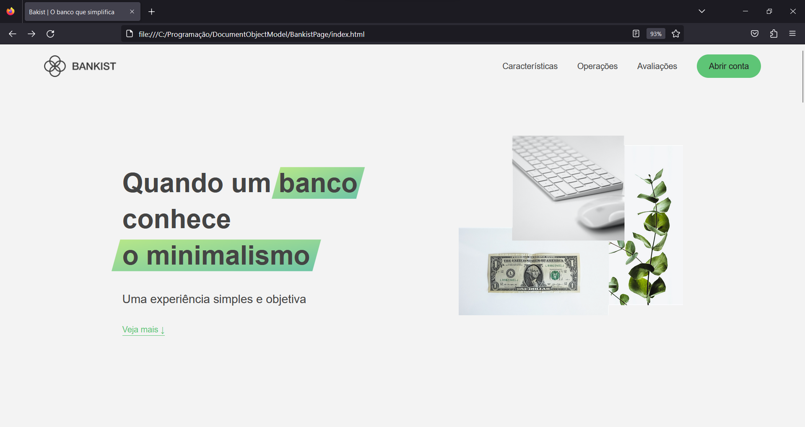
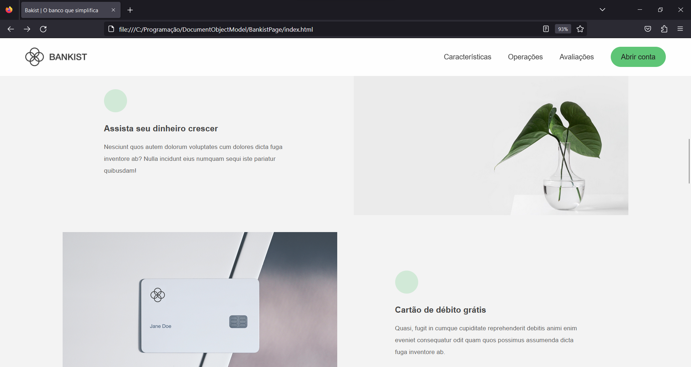
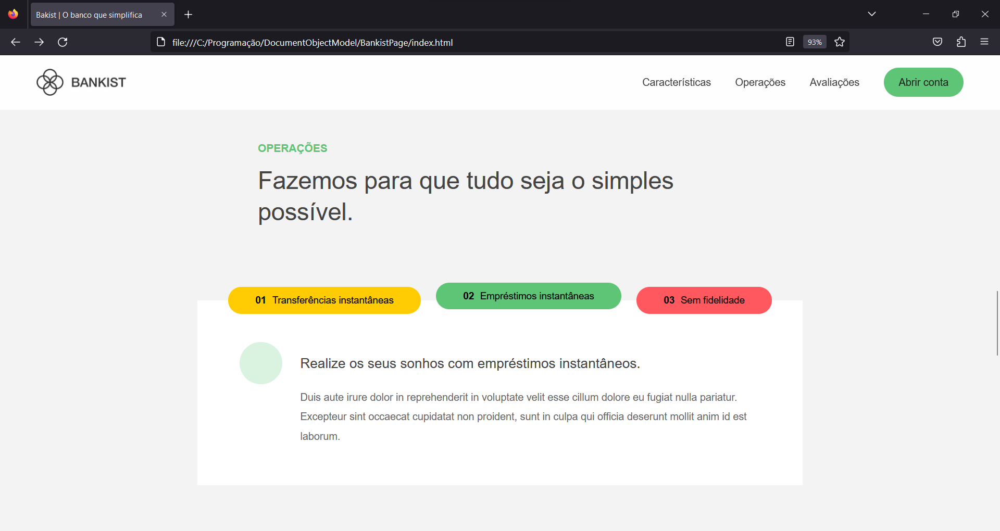
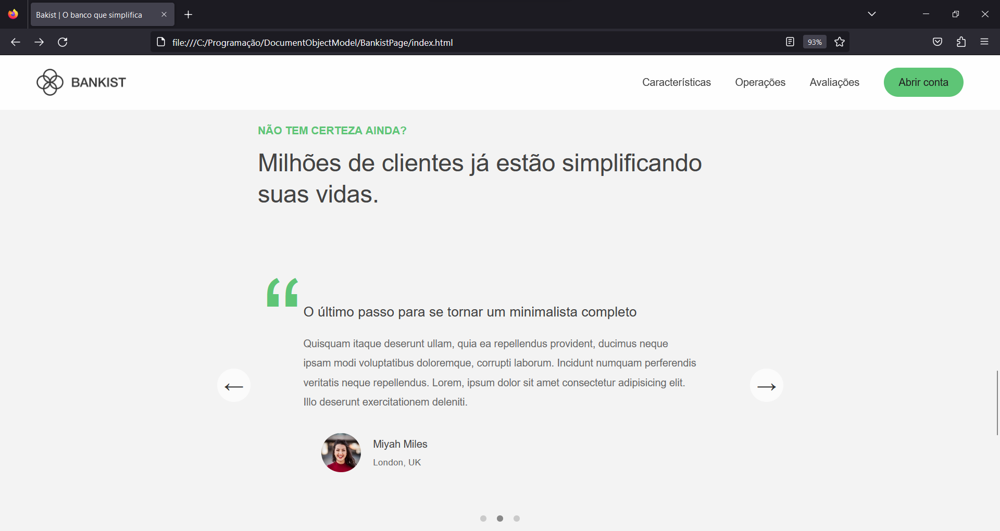
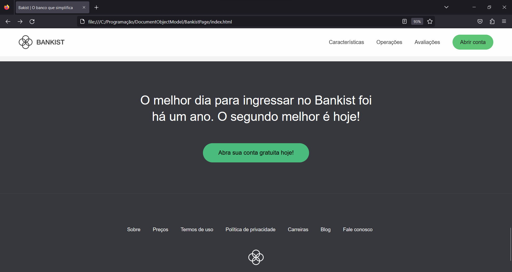
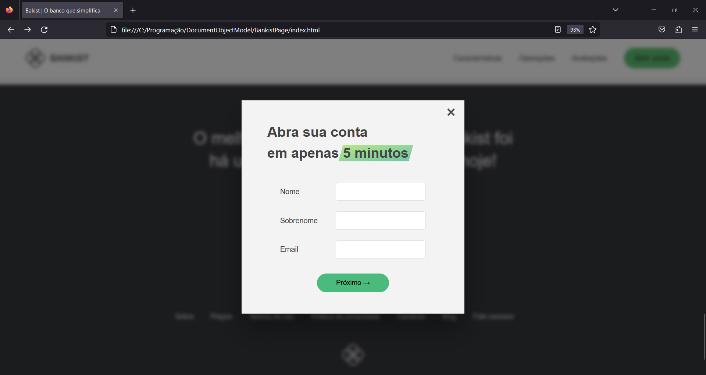

# Bankist Landing Page

### Sumário
* [Conteúdos](#conteúdos)  

## Sobre
**Bankist**, o Banco que Simplifica. Projeto sem nenhum intuito comercial/sério, apenas para manipular a DOM e aperfeiçoar os conhecimentos de JavaScript/TypeScript. 
Programado de forma imperativa. 

Pprojeto programado sem uso de nenhum framework, conta com diversos componentes interativos, por exemplo: Smooth Scrolling, Tab Component, Sticky Navigation, Mostrando elementos durante o scroll, Lazy Loading e um Slider :). Foi ótimo para aprender conceitos avançados sobre Web Development, como:
* Diferença sútil entre os retornos dos métodos de seleção, para citar alguns:
  * `.querySelector<T>()` **(T | null)**, 
  * `.querySelectorAll<T>` **(NodeListOf&lt;T>)**,
  * `.getElementsByTagName<T>()` **(HTMLCollectionOf&lt;T>)** 
  * `HTMLCollectionOf` ≠ `NodeListOf`
* "Capturar" estilos do CSS computados pelo navegador com JavaScript 
* Diferentes formas de criar e posicionar elementos, alguns por exemplo:
  * `createElement()`
  * `insertAdjacentHTML()`
  * `append()` & `prepend()`
  * `before()` & `after()`
* Diferença entre `Node` e `Element`
* Manipular de todas as formas as propriedades dos elementos e mudar váriaveis no CSS
* **Event Propagation** - como o browser cria e gerencia os eventos gerados pelo JavaScript
  * Event Capturing
  * Event Bubbling
* **Event Delegation** - melhora a performace
* **DOM Traversing**, "viajar" pela DOM Tree a partir de elementos pais ou de elementos irmãos (`closest()`, `previousElementSibling`, `nextElementSibling`))
* **Intersection Observer API** - um jeito rápido e simples de "observar" elementos e reagir de acordo, mais performático que `.addEventListener()`
* **Lifecycle DOM Events**

### Conteúdos  
* [Sobre](#sobre)  
* [Tecnologias](#tecnologias)  
* [Quick Start](#quick-start)  
* [File Tree](#file-tree)  
* [Screenshots](#screenshots)  

## Tecnologias
* HTML
* CSS
* TypeScript

## Quick Start
**Visualizar**
* Baixar o repositório
* Descompactar a pasta
* Copiar o caminho do index.html e colocar na URL do navegador

**Modificar**
* Caso queira alterar, certifique-se que tenha uma versão do Node instalada, caso não tenha: https://nodejs.org/en/
* Tenha o TypeScript baixado globalmente, caso não tenha: `npm install -g typescript`
* Dentro de **./src** comece a modificar o arquivo index.ts e transforme o código em JS com `tsc` no terminal, ou `tsc -w` para atualizar automaticamente

Se caso houver algum erro no terminal relacionado a políticas de segurança, execute os comandos no CMD ou no próprio PowerShell com os comandos seguidos de 
".cmd" - 
```
tsc.cmd -w
```

## File Tree
```
.
├── public/
│   ├── assets/
│   │   └── ...
│   ├── css/
│   │   └── style.css
│   └── js/
│       └── index.js
├── src/
│   ├── tests/
│   │   └── playground.ts
│   └── index.ts
├── .prettierrc
├── index.html
└── tsconfig.json
```

## Screenshots







